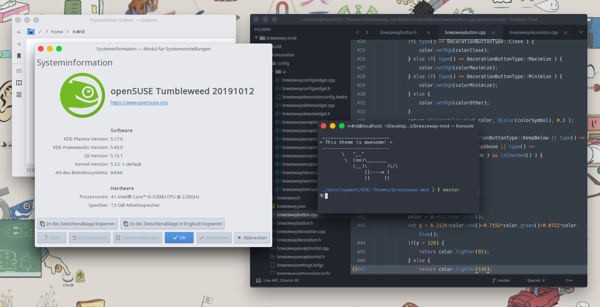
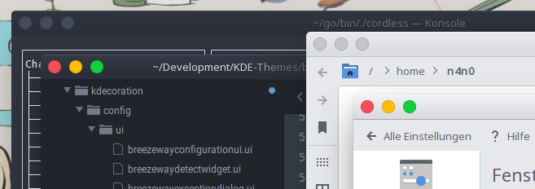

# BreezewayMod

## About

 

**BreezewayMod** is a fork of the [Breezeway](https://github.com/richard-kung/breezeway) window decoration, which aims to mimic the *macOS style*, but with **power ups**.

> **Note**: it comes without weird glitches on the rounded corners.

## Preview



> Looks great  with light and dark color schemes. Shown here with [Arc](https://github.com/PapirusDevelopmentTeam/arc-kde) and [Arc-Dark](https://github.com/PapirusDevelopmentTeam/arc-kde) color schemes.


| The usual glitch on dark themes            |  |
| ------------------------------------------ | :-------------------: |
| Glitch be gone with BreezewayMod. *Magic!* |  |
| Glitch be gone with BreezewayMod. *Magic!* |  |

On overlapping windows with not enough contrast between each other, it's hard to see overlapping titlebars if using a flat theme. Luckily, **BreezewayMod** comes with a neat highlight line across the top of titlebars to get that sorted out:



> **Note**: if you wish to have subtle gradients with a nicely drawn separator for titlebars, you can have just that. The gradient and separator will, like all nifty color features, use the title bar color to determine their values. *How cool is that?*

## Experimental Features

With the power of Halloween and the dark arts combined, we can now match the titlebars color to the windows color... And I don't mean some lame shit where I make use of `QPalette::Window` in the hopes of getting a nice looking window color... Hmmm, no, no no!


> **Note**: this feature is still in early beta though and color glitches *will* occur. Uncheck **Match colors** in Plasma Settings to turn this feature off.

## Building and Installation

Before preceding with the actual install process, make sure you have the following dependencies installed (for Ubuntu 18.04 and derivates):

    - cmake
    - g++ / clang
    - extra-cmake-modules
    - libkdecorations2-dev
    - ibkf5guiaddons-dev
    - libkf5configwidgets-dev
    - libkf5windowsystem-dev
    - libkf5package-dev
    - libqt5x11extras5-dev
    - gettext
    - pkg-config (optional)

Clone this repository:

```
git clone https://github.com/n4n0GH/breezeway-mod
```
> **Note**: it is recommended to clone it somewhere where you can leave the built directory in case you want to uninstall it. If you accidentally deleted the directory, check below for how to uninstall manually.

Change to **breezeway-mod** folder and create a subfolder called **build**:

```
cd breezeway-mod && mkdir build && cd build
```

To install, use `cmake`, `make` and `make install`:

```
cmake -DCMAKE_INSTALL_PREFIX=/usr ..
make && sudo make install
```

## Uninstalling

In the build directory, run:

```
sudo make uninstall
```

If you don't have this directory anymore, you'll need to manually delete the following files and folders:

```
/usr/lib64/cmake/BreezewayMod/BreezewayConfig.cmake
/usr/lib64/cmake/BreezewayMod/BreezewayConfigVersion.cmake
/usr/lib64/qt/plugins/org.kde.kdecoration2/breezewaydecoration.so
/usr/share/kservices5/breezewaydecorationconfig.desktop
/usr/lib64/libbreezewaycommon5.so.5.16.5
/usr/lib64/libbreezewaycommon5.so.5
```

## FAQ

- What's the biggest differences between this and [Breezeway](https://github.com/richard-kung/breezeway)?
	*As of now there are so many changes that it's fair to say it's a completely different theme.*
